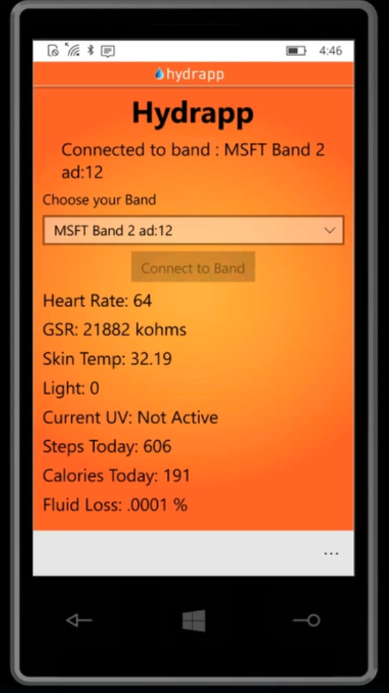

# Hydrapp

- Hydrapp is an anti-dehydration application that specializes in monitoring fluid loss of any person as a result of physical effort.

- Hydrapp was developed as Part of an E-Health and Cloud Technologies Workshop - see website for documentation.

# Hydrapp Application Supports:
- Microsoft Band 2
- Windows 10 
- Windows Phone

# Hydarpp features:
- Measures your heart rate, GST, Skin Temp, Light, UV, Steps, Calories and Fluid Loss and can integrate all of that information to give a better picture on each User.

- Managing group feature, allows trip guides, army commanders, family members, or anyone who wants to monitor other members' health condition and make sure they stay hydrated.

# Video
https://www.youtube.com/watch?v=sCWgWnbH7R0&t=1s

# Technology
- Azure cloud 
- .Net
- Xamarin Forms
- Microsoft Band SDK
